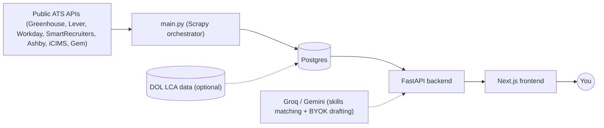

# HuntLoop


HuntLoop is a personal job-search automation and resume-matching
platform. It scrapes real job postings from seven applicant-tracking
systems' public APIs — Greenhouse, Lever, Workday, SmartRecruiters,
Ashby, iCIMS, Gem — with no third-party job board or paid API involved.

A FastAPI backend and Next.js frontend then score each posting against
your resume using sentence embeddings and an LLM-backed skills-gap
analysis. It can also flag whether a company has a real history of
H-1B visa sponsorship, using actual DOL wage-filing data, and gives you
a dashboard, job list, and application tracker to run the search.
Everything is self-hosted: your resume and application data stay in
your own database.

See ["Project status"](#project-status) for what's built, and
`CLAUDE.md` for full architectural detail this file doesn't repeat.

## Table of contents

- [Features](#features)
- [Architecture](#architecture)
- [Quick start](#quick-start)
- [Prerequisites](#prerequisites)
- [Manual / local setup](#manual--local-setup)
- [Run with Docker](#run-with-docker)
- [Running the scraper](#running-the-scraper)
- [Logging](#logging)
- [Scheduled runs](#scheduled-runs)
- [Running tests](#running-tests)
- [API service](#api-service)
- [Frontend](#frontend)
- [Demo mode](#demo-mode-optional)
- [Reverse proxy / HTTPS for self-hosting](#reverse-proxy--https-for-self-hosting-optional-opt-in)
- [Observability stack](#observability-stack-optional-opt-in)
- [H-1B sponsorship data](#h-1b-sponsorship-data-optional)
- [Adding a company to scrape](#adding-a-company-to-scrape)
- [Troubleshooting / FAQ](#troubleshooting--faq)
- [Feedback and contributions](#feedback-and-contributions)
- [Data limitations](#data-limitations)
- [How this was built](#how-this-was-built)
- [Project status](#project-status)
- [License](#license)

## Features

- **Multi-ATS scraper** across 7 real platforms (Greenhouse, Lever,
  Workday, SmartRecruiters, Ashby, iCIMS, Gem), feeding a normalized
  Postgres schema (companies, postings, locations, skills, department,
  employment type).
- **Resume-to-job match scoring** — sentence embeddings blended with an
  LLM-backed (Groq/Gemini) matched/missing-skills analysis, computed per
  posting against whichever resume version you've activated.
- **Optional H-1B/DOL sponsorship matching** against real government LCA
  wage-filing data, with a rough per-company salary estimate derived
  from those same filings.
- **A FastAPI backend** exposing filtering/sorting/pagination over
  postings, an application tracker, resume version management, and a
  BYOK (bring-your-own-key) resume-grounded drafting assistant.
- **A Next.js frontend** — dashboard, filterable job list (cards/table
  views), a job detail page with a chat assistant, a kanban/list
  application tracker, and resume upload/version management.
- **Fully containerized**: one `docker compose up --build` brings up
  Postgres, the scraper, the API, and the frontend together, already
  migrated and pre-seeded with real sample data.
- **CI** (GitHub Actions) running the full backend + frontend test
  suites against a real Postgres service on every push/PR.
- **Optional opt-in extras**: a Caddy-fronted HTTPS reverse proxy for
  self-hosting on a real domain, and a Prometheus/Grafana observability
  stack for scrape metrics.

## Architecture



The scraper (`main.py`) and the API/frontend are independent processes.
They only share the same Postgres database — the scraper never calls
the API, and the API never scrapes. Resume embeddings and
skills-matching calls go out to Groq/Gemini. Everything else stays in
your own Postgres instance.

## Quick start

Both paths below get you a fully working local instance with real
sample data (194 job postings across 28 companies) — pick whichever
fits how you work. Full detail on each is further down this file.

### Docker (recommended)

```bash
git clone <repo-url>
cd HuntLoop

cp .env.example .env
# edit .env: fill in POSTGRES_USER, POSTGRES_PASSWORD, POSTGRES_DB

docker compose up --build
```

Then open http://localhost:3000/dashboard — migrations and sample-data
seeding both happen automatically before the app starts; no manual step
needed. See ["Run with Docker"](#run-with-docker) below for the full
detail on what this actually does under the hood, and the
[Troubleshooting / FAQ](#troubleshooting--faq) section if `docker compose
up` fails with a network/subnet error.

### Manual / local setup

```bash
git clone <repo-url>
cd HuntLoop

python3 -m venv .venv
source .venv/bin/activate

pip install -r requirements.txt

cp .env.example .env
# edit .env and fill in your real DATABASE_URL

alembic upgrade head
python scripts/seed_sample_job_postings.py
```

Then, in two separate terminals:

```bash
PYTHONPATH=src uvicorn huntloop.api.main:app --reload
```

```bash
cd frontend
npm install
npm run dev
```

Open http://localhost:3000/dashboard. See
["Manual / local setup"](#manual--local-setup) below for the full
detail, and the [Troubleshooting / FAQ](#troubleshooting--faq) section
if you're on macOS Intel (x86_64) — `pip install` needs one extra step
there.

## Prerequisites

- Python 3.13 (what this repo's virtualenv is built with — no stricter
  pin exists yet) **except on macOS Intel (x86_64), which needs Python
  3.12 instead — see the [Troubleshooting / FAQ](#troubleshooting--faq)
  section for why and the exact workaround.**
- PostgreSQL (developed/tested against Postgres 18, running locally)
- A Postgres role with privileges on the target database (`CREATE`, `SELECT`,
  `INSERT`, `UPDATE`, `DELETE` on its tables)
- Docker + Docker Compose, if you're taking the Docker path instead of
  the manual one — nothing else to install first in that case.

## Manual / local setup

```bash
git clone <repo-url>
cd HuntLoop

python3 -m venv .venv
source .venv/bin/activate

pip install -r requirements.txt

cp .env.example .env
# edit .env and fill in your real DATABASE_URL

alembic upgrade head

python scripts/seed_sample_job_postings.py
```

`.env.example` documents the expected format:

```
DATABASE_URL=postgresql+psycopg2://<user>:<password>@localhost:5432/<dbname>
```

The app fails fast with a clear error if `DATABASE_URL` is missing — see
`huntloop/settings.py`.

`alembic upgrade head` creates/updates all tables (`companies`, `job_sources`,
`job_postings`, `job_locations`, `job_skills`, `job_metadata`,
`lca_disclosures`, `sponsor_name_overrides`, `resume_versions`,
`job_applications`) to match the current schema.

`python scripts/seed_sample_job_postings.py` loads the same small real
sample dataset (~194 real job postings across 28 companies spanning all 7
implemented ATS platforms — see `data/samples/README.md`) the Docker
path's `seed` service auto-runs, so a manual/non-Docker install ends up
with the same populated-on-first-run experience instead of an empty
dashboard — this step is genuinely optional (the API/frontend below work
fine against an empty database, they'll just show zero jobs/companies
until you run a real scrape), but skipping it means starting from empty.
It only needs `DATABASE_URL` in the environment (same as everything
else here) — no Docker-specific assumptions (network hostnames,
hardcoded connection details) anywhere in the script. It's also
idempotent and safe to re-run: it checks `SELECT COUNT(*) FROM
job_postings` first and does nothing (logs one line, exits 0) if that's
already non-zero, whether from a previous run of this script or your own
real scrape — see the script's own module docstring for the full
reasoning.

At this point you have a fully migrated, sample-populated local database.
To actually run the app against it:

- **API**: `PYTHONPATH=src uvicorn huntloop.api.main:app --reload` — see
  ["API service"](#api-service) below for the full endpoint list and
  options.
- **Frontend**: `cd frontend && npm install && npm run dev` — see
  ["Frontend"](#frontend) below; by default it talks to
  `http://localhost:8000`, which is where the command above serves the
  API.

Verify it end-to-end:

```bash
curl http://localhost:8000/dashboard/stats
# {"total_jobs":194,"total_companies":28,"applications_by_status":{...},"new_jobs_last_7_days":194}
curl http://localhost:8000/jobs?limit=3
# real job postings from the sample dataset

open http://localhost:3000/dashboard   # or /jobs — real data, not an empty state
```

## Run with Docker

Runs the full stack as containers via Docker Compose: Postgres 18, the
scraper/pipeline (`app`), the API (`api`), and the frontend. This is a
separate Postgres instance from any local one, exposed on host port
`5433` (not `5432`) so there's no ambiguity about which database gets
written to. Its data lives in a named volume (`pgdata`) that persists
across `docker-compose down`/`up`.

```bash
cp .env.example .env
# edit .env: fill in DATABASE_URL, POSTGRES_USER, POSTGRES_PASSWORD, POSTGRES_DB
# (the containerized app builds its own DATABASE_URL from the POSTGRES_* vars,
# pointed at the `db` service, so DATABASE_URL itself only matters if you also
# run things locally against localhost:5432)

docker compose up --build
```

That's it — **no separate manual `alembic upgrade head` step is needed
anymore.** A one-shot `seed` service (see `docker-compose.yml`) runs once,
automatically, before `app`/`api` are allowed to start: it applies every
pending migration, then seeds a small real sample dataset (~194 real job
postings across 28 companies spanning all 7 implemented ATS platforms —
see `data/samples/README.md` for exactly what's in it) into a fresh
database, so the first thing you see — the dashboard, the job list, the
API's own responses — is populated with real data, not empty. The sample
seed is gated on `job_postings` being genuinely empty: run
`docker compose up` again later, after you've onboarded your own companies
and run a real scrape, and the `seed` service's logs will show it
detecting your real data and skipping the sample seed entirely (`docker
compose logs seed`) — it never re-runs or overwrites anything once real
data exists, whether that's the sample itself or your own scrape.

`docker-compose down -v` tears everything down, including the `pgdata`
volume, for a clean slate (the next `docker compose up` re-seeds the
sample dataset from scratch, since the volume — and therefore
`job_postings` — is empty again).

**`docker compose up` (no extra flags, no `--profile`) brings up the
full stack** — `db`, `app`, `api`, and `frontend` together, with no
separate `npm run dev`/`uvicorn --reload` step required. See ["API
service"](#api-service) and ["Frontend"](#frontend) below for what each
one is.

If `docker compose up` fails with a `Pool overlaps with other one on
this address space` error, see the
[Troubleshooting / FAQ](#troubleshooting--faq) section below — it's a
known, fixable network-subnet collision, not a bug in the stack itself.

## Running the scraper

From the repo root:

```bash
python main.py
```

`main.py` is a multi-ATS orchestrator. It queries `companies.ats_platform`
(populated by the onboarding/detection scripts under `scripts/` — see
`CLAUDE.md`), groups companies by platform, and runs the matching spider
(`GreenhouseScraper`, `LeverScraper`, `WorkdayScraper`,
`SmartRecruitersScraper`, `AshbyScraper`, `IcimsScraper`, `GemScraper`)
once per platform with that platform's full token list. A company with
an unrecognized, `unknown`, or `NULL` platform is skipped with a clear
log message, not silently dropped. Every spider pipes each posting
through the same `JobDataPipeline`, which upserts the company/source and
inserts the posting, including its locations, skills, department, and
employment type, into Postgres.

Expect Scrapy's standard crawl log, plus pipeline log lines for each item,
e.g.:

```
2026-08-19 12:55:04,123 [WARNING] huntloop.pipelines: [PIPELINE TRIGGERED] Processing item: Chief of Staff
2026-08-19 12:55:04,150 [INFO] huntloop.pipelines: Skipping reposted job 7913718
```

(`Skipping reposted job` means that `gh_job_id` was already in the database —
expected on any run after the first. On a genuinely new posting you'll instead
see `Inserted job: <title> for <company>`.) The run ends with Scrapy's stats
dump (`item_scraped_count`, `finish_reason: finished`, etc.) and:

```
2026-08-19 12:54:46,001 [INFO] huntloop.pipelines: JobDataPipeline closed
2026-08-19 12:54:46,002 [INFO] scrapy.core.engine: Spider closed (finished)
```

## Logging

All logging — the scraper, the pipeline, and the one-off scripts in
`scripts/` — goes through a shared setup in `huntloop/logging_config.py`.
It uses a consistent format (timestamp, level, module, message) and
writes to both the console and a rotating log file at `logs/huntloop.log`
(gitignored, capped at 5MB per file with 3 backups).

The log level defaults to `INFO`. Override it with the `LOG_LEVEL`
environment variable, e.g.:

```bash
LOG_LEVEL=WARNING python main.py
```

## Scheduled runs

Three stages run on the same daily schedule: the scraper orchestrator
(`main.py`), the skills-matching backfill
(`scripts/backfill_skills_matching.py`), and the department-categorization
backfill (`scripts/backfill_department_category.py`). Together they keep
both newly-scraped and backlogged postings matched against the active
resume and categorized, with no manual step.

This is local-only automation, for a dev machine that's actually awake
at the scheduled time. It isn't a substitute for real deployment
scheduling, such as GitHub Actions against a hosted Postgres — that's a
separate, later step once there's a publicly reachable database (see
`huntloop-architecture-decisions.md`).

**On this project's own dev machine the actual trigger is `launchd`, not
`cron`** — `cron` doesn't run a missed job when the Mac is asleep, which
made a real overnight 3am `cron` schedule silently never fire; see
`CLAUDE.md`'s Scheduling entries for the full launchd migration and its
boot/login catch-up job. The `crontab` instructions below still work as a
generic, portable way to schedule the same wrapper script on any machine
(cron is what most non-macOS setups would actually use) — they're not
wrong, just not what this specific dev machine runs day to day.

`scripts/run_orchestrator_cron.sh` is the entrypoint the scheduler calls
(the name predates the later `cron`→`launchd` migration above; it wasn't
renamed). It's a thin wrapper, not a parallel code path: it `cd`s into the
repo (the scheduler's working directory isn't otherwise predictable), then
runs each stage with `.venv/bin/python` (stage 1 now runs via
`docker compose run` instead — see `CLAUDE.md`'s "the daily scraper itself
now runs via Docker" entry) — the same scripts, same `.env`/
`DATABASE_URL`/`GROQ_API_KEY` a manual run uses. Nothing about credentials
or config is duplicated for the scheduled path. All three stages always
run, regardless of whether an earlier one succeeded — a scraping hiccup
shouldn't stall skills-matching or categorization progress on the backlog,
and vice versa. The skills-matching stage works through whatever
job_postings rows still have `matched_skills IS NULL` (best resume-match
score first, see `CLAUDE.md`), respecting each provider's real daily
free-tier budget, and simply stops itself cleanly for the day once that
budget is exhausted — picking back up automatically on the next scheduled
run. That's expected steady-state behavior, not a failure.

**Enable it** (runs daily at 3:00 AM local time):

```bash
(crontab -l 2>/dev/null; echo "0 3 * * * $(pwd)/scripts/run_orchestrator_cron.sh") | crontab -
```

**Check it's installed:**

```bash
crontab -l
```

```
0 3 * * * /Users/niramaykelkar/Desktop/HuntLoop/scripts/run_orchestrator_cron.sh
```

**Disable it** (removes just this line, leaves any other crontab entries
alone):

```bash
crontab -l | grep -v 'run_orchestrator_cron.sh' | crontab -
```

**Where to check whether a scheduled run happened, and what it did:**

- `logs/cron.log` — append-only, wrapper-level marker log. One
  start/end pair per run, with a per-stage breakdown and the exit code
  of each, e.g.:
  ```
  === HuntLoop scheduled run started 2026-08-22 03:00:01 PDT ===
  --- stage 1/2: scraper orchestrator (main.py) ---
  --- stage 1/2 finished with exit code 0 ---
  --- stage 2/2: skills-matching backfill (scripts/backfill_skills_matching.py) ---
  --- stage 2/2 finished with exit code 0 ---
  === run finished with exit code 0 (scrape=0, skills=0) at 2026-08-22 03:04:12 PDT ===
  ```
  A non-zero overall exit code (or an `ERROR: .venv/bin/python not
  found` line, if the venv itself is missing) means at least one stage
  failed. Check this file first — it's the fastest way to answer "did
  last night's run happen, and did it succeed." Note that the skills-
  matching stage stopping early with a `Backfill stopped early (daily
  quota exhausted)` line is normal, not a failure — it still exits 0.
- `logs/huntloop.log` — the same rotating, shared-logging file every
  manual run also writes to (see ["Logging"](#logging) above; 5MB cap, 3
  backups). Scheduled runs show up in it exactly like manual ones — same
  format, same per-company INFO/WARNING lines, same Scrapy stats dump at
  the end for stage 1, and the same per-job/per-batch INFO/WARNING lines
  for stage 2 (including which jobs got a skills match, which were
  rejected by the sanity filter, and why). This is where to look for
  *what* happened during a run, not just whether it succeeded.

The scheduled job assumes Postgres is already reachable at
`DATABASE_URL` when it fires (same requirement as a manual run — this
wrapper doesn't start or manage any database). On this repo's dev
machine that's a locally-installed Postgres 18 running as a system
service on port 5432, independent of the `docker-compose` `db` service
described below (which is a separate, smaller Postgres instance on port
5433 for the containerized workflow — see ["Run with Docker"](#run-with-docker)).
If `DATABASE_URL` points somewhere not currently running, the run fails
fast with a clear connection-error traceback in `logs/huntloop.log`,
same as it would for a manual run.

## Running tests

```bash
pytest
```

The suite has grown well past the original pipeline smoke tests. It now
covers the pipeline, spiders, ATS detection/onboarding, matching, the
API, and more (300+ tests as of this writing — don't expect that count
to stay accurate; run `pytest` for the real current total). Illustrative
early example, still representative of the format:

```
============================= test session starts ==============================
collected 2 items

tests/test_pipeline.py::test_process_item_inserts_job_posting PASSED     [ 50%]
tests/test_pipeline.py::test_duplicate_job_url_hits_integrity_error_handler PASSED [100%]

============================== 2 passed in 1.00s ===============================
```

Tests run against a throwaway Postgres schema created for the test session
(same server as `DATABASE_URL`, different namespace) — they never read or
write your real `job_postings` data. See `tests/conftest.py`.

## API service

A FastAPI backend at `src/huntloop/api/main.py`, separate from the
scraper/orchestrator (`app`). Its own `api` service in
`docker-compose.yml` connects to the same bundled `db` service `app`
uses, not a separate host Postgres. It's self-contained for a fresh
`docker compose up` — the same `seed` service migrates and seeds it
first, so it never starts against an empty database. Point it at your
own host Postgres instead by overriding `DATABASE_URL` in your `.env`;
no code change needed.

Endpoints (see `CLAUDE.md` for full per-endpoint detail — this list is
kept to the shape, not every query param/edge case):

- `GET /health` - basic liveness check.
- `GET /jobs` - paginated list of job postings, each with its calibrated
  composite match score (`match_score`, embedding similarity blended with
  skills-match ratio - see `CLAUDE.md`) against the active resume,
  precomputed `matched_skills`/`missing_skills`, sponsor/salary-estimate
  info, and application status (defaults to `not_applied` if no
  `job_applications` row exists yet). Query params: `company`
  (case-insensitive filter), `department`, `employment_type`, `location`
  (repeatable, OR'd), `min_score` (0-1, requires an active resume),
  `salary_min`/`salary_max`/`salary_unspecified`, `sort` (`score` or
  `-score`, default `-score` - best matches first), `limit`/`offset`.
- `GET /jobs/{id}` - single job, same fields plus the full
  `job_description` (rendered as sanitized HTML by the frontend).
- `GET /jobs/departments` / `GET /jobs/employment-types` / `GET /jobs/locations`
  - the real distinct filter values behind the `GET /jobs` params above
  (departments/locations are canonicalized, not raw free text).
- `PATCH /jobs/{id}/application` - upserts the application status for a
  job (`{"status": "applied", "notes": "..."}`) - one row per job, not a
  history; `applied_at` is set the first time status moves away from
  `not_applied` and never overwritten by later status changes.
- `GET /dashboard/stats` - total jobs/companies, applications by status,
  new-jobs-in-the-last-7-days.
- `GET /resumes` / `POST /resumes/upload` / `PATCH /resumes/{id}/activate`
  - resume version history, PDF upload (extract → embed → activate), and
  reactivating a prior version.
- `POST /jobs/{id}/draft-answer` - BYOK (bring-your-own-key) resume-grounded
  drafting of free-form application answers via a user-supplied Groq/Gemini
  API key (`{"prompt", "provider", "api_key"}`) - the key is never read
  from server-side env vars, never persisted, never logged. **See the
  security note in ["Reverse proxy / HTTPS for self-hosting"](#reverse-proxy--https-for-self-hosting-optional-opt-in)
  below before exposing this on anything but localhost** - it handles a
  real third-party credential per request.

Run it via Docker:

```bash
docker-compose up --build -d api
curl http://localhost:8000/health        # {"status":"ok"}
curl http://localhost:8000/jobs?limit=5  # real job postings + match scores
open http://localhost:8000/docs          # interactive OpenAPI docs
```

Or locally, without Docker (same `.venv`/`.env` as everything else):

```bash
PYTHONPATH=src uvicorn huntloop.api.main:app --reload
```

**CORS**: the API allows `http://localhost:3000`/`http://127.0.0.1:3000`
by default (the Next.js dev server's own default origin) via
`CORSMiddleware` - override with the comma-separated
`CORS_ALLOWED_ORIGINS` env var if the frontend runs somewhere else.
Browser requests need this; server-to-server calls (curl, `httpx`, etc.)
are unaffected either way, since CORS is a browser-enforced restriction.

## Frontend

A Next.js (App Router) app in `frontend/` — TypeScript, Tailwind CSS,
TanStack Query for data fetching. Real pages exist for:

- **Dashboard** (`/dashboard`, the default landing route)
- **Job list** (`/jobs`) — filterable/sortable, cards or table view
- **Job detail** — matched/missing skill chips, sponsor/salary-estimate
  sidebar, sanitized-HTML description, and a chat assistant panel
  (read-only Q&A plus the BYOK drafting endpoint)
- **Application tracker** (`/applications`) — kanban and list views
- **Resume version management** (`/resumes`) — upload and activate

`frontend/src/types/api.ts` and `frontend/src/lib/api.ts` mirror the
backend's Pydantic schemas/endpoints, kept manually in sync (no shared
codegen — a known gap). See `CLAUDE.md`'s frontend bullet for full
page-by-page detail.

**Now containerized** (`frontend/Dockerfile`, a `frontend` service in
`docker-compose.yml`) - `docker compose up` alone runs a production-style
build (`next build && next start`) and serves it on host port `3000`,
so a stranger's first run needs no local Node/npm install at all:

```bash
docker compose up --build -d api frontend   # or just `docker compose up --build` for the full stack
open http://localhost:3000
```

`NEXT_PUBLIC_API_URL` is baked in at build time (`next build` inlines
`NEXT_PUBLIC_`-prefixed vars into the browser bundle - see
`src/lib/api.ts`), passed as a Docker build arg in `docker-compose.yml`
rather than a runtime `environment:` entry. It defaults to
`http://localhost:8000` there too, matching the `api` service's own
host-mapped port - the browser talks to that port directly regardless of
whether either service is containerized, since none of this runs
container-to-container.

This doesn't replace local development - `npm run dev`'s hot reload (via
Turbopack) is still meaningfully faster to iterate against than a Docker
image rebuild loop, and remains the right way to actively work on the
frontend:

```bash
cd frontend
npm install
npm run dev
open http://localhost:3000
```

By default it talks to `http://localhost:8000` - override with
`NEXT_PUBLIC_API_URL` in `frontend/.env.local` (see
`frontend/.env.local.example`) if the API is running somewhere else. The
API must already be running for either workflow above - via Docker (per
["Run with Docker"](#run-with-docker)/["API service"](#api-service)) or
`uvicorn ... --reload`.

## Demo mode (optional)

Nothing is deployed publicly yet, so there is no live link here - this
is the local mechanism for building one later.

`DEMO_MODE=true` on the API (see `huntloop.demo_mode`) turns it
read-only: the resume upload/activate routes and the BYOK drafting
route are not mounted, the tracker PATCH becomes a no-op, and every
route gets a per-IP rate limit. `requirements-demo.txt` +
`Dockerfile.demo` build a lean image with no torch/sentence-transformers
at all. `scripts/build_demo_dataset.py` builds a small, safe sample
database (about 10,000 real postings, per-company sponsor aggregates
instead of raw LCA rows, one fictional resume) from a source database
into a target database, and refuses to run if they are the same
database. On the frontend, `NEXT_PUBLIC_DEMO_MODE=true` (build time)
shows a banner, hides the AI assistant and resume-upload controls, and
shows a wake-up message if a sleeping free-tier backend is slow to
answer. See `SESSIONS.md`'s "Add read-only demo mode and a demo dataset
builder" entry for the full detail.

## Reverse proxy / HTTPS for self-hosting (optional, opt-in)

**Not needed for local/localhost use.** Plain `docker compose up` never
starts this. It exists for anyone running this stack on a real server,
reachable at a real domain over real HTTPS instead of plain HTTP. The
stack has no TLS of its own — see `src/huntloop/drafting.py` and
`src/huntloop/api/routers/drafting.py` for why that matters before
exposing `POST /jobs/{id}/draft-answer`, which handles a real
third-party API key, on any public deployment.

This uses [Caddy](https://caddyserver.com/) as an optional reverse proxy
in front of the existing `api`/`frontend` services, behind a `proxy`
Compose profile (same pattern as the `observability` profile below -
nothing starts unless you opt in). Caddy was chosen over nginx+certbot
and Traefik for this project specifically: automatic HTTPS needs only a
domain name in a Caddyfile (no separate certbot/acme-companion container,
no per-service ACME labels), it's a single ~24MB container, and that
matches a solo self-hoster's scale better than Traefik's per-service
label config or nginx-proxy's two-container/shared-volume setup.

### What you provide

- **A real domain name** (or subdomain) you own.
- **A DNS A-record** for that domain pointing at your server's public IP
  address.
- **Ports 80 and 443 reachable** on that server - open in any firewall,
  and forwarded if the server is behind NAT. Port 80 is required even
  though everything ends up served over HTTPS - Let's Encrypt's HTTP-01
  domain-validation challenge and Caddy's own HTTP→HTTPS redirect both
  need it.

### What the repo provides

- The `caddy` service in `docker-compose.yml` (behind `profiles:
  ["proxy"]`) and `caddy/Caddyfile`.
- A `caddy_data` named volume for Caddy's certificates and ACME account
  key. **This must persist** - repeatedly losing it and re-issuing risks
  Let's Encrypt's real rate limits (5 failed validations per
  account/hostname/hour, 5 duplicate certificates for the same hostname
  set per week), so don't tear it down with `down -v` unless you
  genuinely want to throw the certificate away.
- `caddy/Caddyfile` itself reads `{$HUNTLOOP_DOMAIN}` from the
  environment rather than a hardcoded example domain - Caddy refuses to
  start with it unset, so there's no way to accidentally run this
  against a placeholder hostname.
- Path-based same-origin routing: Caddy serves the frontend at `/` and
  reverse-proxies `/api/*` (prefix stripped) to the `api` service, whose
  own routes are all rooted at `/` (`/health`, `/jobs`,
  `/dashboard/stats`, ...) with no `/api` prefix of their own. Serving
  both under one HTTPS origin means the frontend can call a plain
  relative `/api` path instead of needing to know its own public domain
  baked in at Docker build time (`NEXT_PUBLIC_API_URL` is otherwise a
  `next build`-time constant - see the ["Frontend"](#frontend) section
  above).

### How to enable it

```bash
# in .env:
HUNTLOOP_DOMAIN=yourdomain.com
NEXT_PUBLIC_API_URL=/api    # so the frontend calls the proxied same-origin path

docker compose --profile proxy up --build -d
```

`NEXT_PUBLIC_API_URL=/api` only matters for this profile - it changes
what gets baked into the `frontend` image at build time, so it must be
set *before* `--build` runs, and only when you're actually fronting the
stack with Caddy. Leaving it unset (the plain no-proxy path covered
earlier in this README) keeps building the frontend against
`http://localhost:8000` exactly as before.

CORS (`CORS_ALLOWED_ORIGINS`, see ["API service"](#api-service) above)
does not need any change for this setup - same-origin path-routing means
the browser never makes a cross-origin request to the API in the first
place, so CORS is moot for traffic that goes through Caddy. Direct calls
to the `api` service's own published port (still available, same as
always) are unaffected either way.

### None of this replaces the plain-HTTP setup

`docker compose up` (no `--profile proxy`) still behaves exactly as
documented above - `api`/`frontend` still publish their own ports
directly, with no Caddy involved and no HTTPS. This section only adds an
opt-in HTTPS front door for a real-domain deployment; it changes nothing
for local/dev use.

If you hit a network-subnet collision bringing up this profile, see the
[Troubleshooting / FAQ](#troubleshooting--faq) section - the same fix
applies here as for plain `docker compose up`.

## Observability stack (optional, opt-in)

Prometheus + Pushgateway + Grafana, for local metrics on scraping
activity. `main.py`'s orchestrator (`huntloop.metrics`) pushes per-run
metrics to the Pushgateway as one batch at the end of each run: jobs
scraped, inserted, skipped-as-duplicate, and errored (labeled by company
and source), plus the run's duration. A pre-provisioned Grafana dashboard
visualizes them. Metrics are observability, not a hard dependency — if
the Pushgateway is unreachable, `main.py` logs one warning and the
scrape completes normally.

These three services live behind the `observability` Compose profile, so
a plain `docker-compose up` (regular dev work) never starts them:

```bash
docker-compose --profile observability up -d prometheus pushgateway grafana
```

- **Prometheus** — http://localhost:9090. Config at
  `observability/prometheus/prometheus.yml`; scrapes the Pushgateway
  (`pushgateway:9091`) every 15s, not the app directly — `main.py` is a
  run-to-completion batch job, not a long-lived process Prometheus could
  poll on its own schedule. Check a scrape target's health at
  http://localhost:9090/api/v1/targets or Status → Targets in the UI.
- **Pushgateway** — http://localhost:9091. Where `main.py` pushes each
  run's metrics before exiting (`huntloop_jobs_scraped_total`,
  `huntloop_jobs_inserted_total`, `huntloop_jobs_skipped_duplicate_total`,
  `huntloop_scrape_errors_total`, `huntloop_run_duration_seconds`). Try it
  manually with any metric name:
  ```bash
  echo 'huntloop_smoke_test_value 42' | curl --data-binary @- \
    http://localhost:9091/metrics/job/smoke_test
  ```
  then, after Prometheus's next 15s scrape, query
  http://localhost:9090/graph?g0.expr=huntloop_smoke_test_value for `42`.
- **Grafana** — http://localhost:3001 (host port `3001`, not Grafana's
  own default `3000` - that port is now the Next.js frontend's, both in
  local dev and via the containerized `frontend` service above, so
  Grafana's host-side port mapping was moved to avoid the collision;
  `docker-compose.yml`'s `grafana` service still maps to container port
  `3000` internally, which is irrelevant from the host). Login
  `admin` / `admin` by default — override with `GRAFANA_ADMIN_PASSWORD`
  in `.env`, local dev
  only, not a real secret). Both its Prometheus datasource
  (`observability/grafana/provisioning/datasources/datasource.yml`) and
  the **"HuntLoop Scraping Activity" dashboard**
  (`observability/grafana/provisioning/dashboards/huntloop-scraping.json`,
  loaded via the file provider at
  `observability/grafana/provisioning/dashboards/dashboards.yml`) are
  pre-provisioned on container start — no manual "Add data source" or
  "Import dashboard" click-through needed on a fresh bring-up. The
  dashboard has 4 panels: jobs scraped over time (by company), jobs
  inserted vs. skipped-as-duplicate (by company), scrape error count, and
  run duration trend — all querying the metrics above directly, no new
  ones. Verify the datasource is connected via the API rather than just
  the UI:
  ```bash
  curl -u admin:admin http://localhost:3001/api/datasources
  # then, using the "uid" from that response:
  curl -u admin:admin http://localhost:3001/api/datasources/uid/<uid>/health
  ```

Tear down with `docker-compose --profile observability down` (add `-v` to
also drop the `prometheus_data`/`grafana_data` volumes). This doesn't
touch `db`/`app` or their `pgdata` volume — the two stacks are
independent.

## H-1B sponsorship data (optional)

**None of this is required to use HuntLoop.** Job scraping, matching, and
the rest of the app work fully with zero H-1B/LCA data loaded — sponsor
status just shows as "not checked" and salary estimates are simply absent
until you set this up. Nothing crashes or degrades in any other way
without it. Think of this section as an optional enhancement layer, not a
setup requirement.

With it, HuntLoop can additionally show whether a company has recent DOL
H-1B (LCA) sponsorship history and a rough salary estimate derived from
that company's own wage filings, by matching scraped companies against
real DOL LCA disclosure data in the `lca_disclosures` table
(`scripts/ingest_lca_disclosures.py` → `scripts/resolve_sponsor_matches.py`).

There is no automated fetching of this data anywhere in this repo, and
there won't be — DOL's disclosure files are downloaded manually, by
design, so nothing in this codebase ever crawls or scrapes a government
website. Two ways to get data in:

### Option A — real, current, full DOL data

1. Go to DOL's Foreign Labor Certification Data Center performance page:
   https://www.dol.gov/agencies/eta/foreign-labor/performance — the "LCA
   Disclosure Data" accordion section lists one Excel file per fiscal
   year/quarter (H-1B, H-1B1, and E-3 combined).
2. Download the most recent quarterly file. As of this writing the latest
   is FY2026 Q3, named `LCA_Disclosure_Data_FY2026_Q3.xlsx`, linked
   directly at `https://www.dol.gov/media/LCA_Disclosure_Data_FY2026_Q3.xlsx`
   (an `.xlsx` file, currently ~240 MB). Download whichever quarter(s) you
   want — more quarters means more historical sponsorship data, but even
   one quarter is enough to get sponsor matching working.
3. Place the downloaded file(s) in `data/raw/dol_lca/` (create the
   directory if it doesn't exist — it's gitignored, since these are large
   raw downloads, not something this repo ships). Keep the original
   filename exactly as downloaded (`LCA_Disclosure_Data_FY<YYYY>_Q<N>.xlsx`)
   — the ingestion script parses the fiscal year and quarter from the
   filename itself.
4. Run the ingestion script:
   ```bash
   python scripts/ingest_lca_disclosures.py
   ```
   This is idempotent (safe to re-run, e.g. after adding a new quarter's
   file) and only ingests `Certified`/`Certified - Withdrawn` (i.e.
   actually-approved) rows.
5. Link scraped companies to this data:
   ```bash
   python scripts/resolve_sponsor_matches.py
   ```
   Re-run this after ingesting more LCA data or scraping new companies.

### Option B — bundled sample dataset (quick demo, no download)

For a quick first look without downloading anything from DOL, load the
small real sample dataset committed at `data/samples/`:

```bash
python scripts/seed_sample_lca_disclosures.py
python scripts/resolve_sponsor_matches.py
```

This is a genuine subset of real DOL LCA disclosure data (not synthetic),
already ingested from DOL's own files — see `data/samples/README.md` for
exactly how it was built and what it contains (~7,200 rows, ~300 KB
compressed). It's meant to make a fresh install look populated and
demonstrate the sponsor-status/salary-estimate features quickly, not to
replace Option A's real/current/full dataset for actual job-hunting use.
Both sample datasets (this one and the job-postings sample from
["Manual / local setup"](#manual--local-setup)/["Run with
Docker"](#run-with-docker) above) are independent and verified safe to
load in either order, or on their own — see `data/samples/README.md` for
the full detail on how they do (and don't) interact.

## Adding a company to scrape

Not exposed via any UI or CLI flag. Companies are onboarded by running
one of the discovery/detection scripts under `scripts/` — `detect_and_store_ats.py`,
`detect_ats_for_sponsors.py`, `discover_and_store_ashby.py`,
`discover_and_store_workday.py`, `discover_and_store_icims.py`,
`discover_and_store_smartrecruiters.py`, `discover_and_store_gem.py` —
each of which writes a `companies` row with `ats_platform`/`ats_token`
(and, for Workday, `careers_url`) populated. Most gate auto-storing a
match behind a confidence check and hold ambiguous matches for human
confirmation via a `--confirmations` file, rather than guessing. See
`CLAUDE.md` for the full per-platform detail. Once a company has a
recognized `ats_platform`, `python main.py` picks it up automatically on
its next run.

## Troubleshooting / FAQ

### `docker compose up` fails: "Pool overlaps with other one on this address space"

Another Docker network on this machine already uses the same subnet
(`172.28.0.0/24` by default — pinned so Caddy has a stable IP for the API
to trust). Check what's taken:

```bash
docker network ls
docker network inspect <network-name>   # look under IPAM.Config for "Subnet"
```

Then set an unused subnet in `.env` (`HUNTLOOP_CADDY_IP` must be a `.x`
address inside it):

```bash
HUNTLOOP_DOCKER_SUBNET=172.31.0.0/24
HUNTLOOP_CADDY_IP=172.31.0.10
```

Both variables are documented with their defaults in `.env.example`.

### `docker compose up` (or the nightly cron scrape) fails: "Bind for 0.0.0.0:5433 failed: port is already allocated"

Another Docker Compose project on this host — a different project, or a
second clone/checkout of this repo — is already bound to host port 5433
(`db`'s host-mapped port). Check what's holding it:

```bash
docker ps -a
lsof -i :5433   # or the platform equivalent
```

Then set an unused host port in `.env`:

```bash
HUNTLOOP_DB_PORT=5434
```

Documented with its default in `.env.example`. The container's own
internal Postgres port (5432) is unaffected — this only changes the
host-side mapping.

### `pip install` fails on `torch`, or embeddings crash at runtime (macOS Intel + Python 3.13)

PyPI's last macOS x86_64 `torch` wheel (`2.2.2`) has no build for Python
3.13. Under Python 3.12 it installs, but conflicts with the NumPy version
everything else in `requirements.txt` needs, crashing at import
(`NameError: name 'nn' is not defined` inside `sentence-transformers`).

**Fix**: build the venv with Python 3.12 instead:

```bash
python3.12 -m venv .venv
```

That unblocks `pip install`, and the scraper/API/frontend/tests all work
without `torch` ever importing (the pipeline treats it as optional and
leaves `embedding`/`is_relevant` `NULL`). For anything that needs a
*working* embedding model on this platform — `scripts/backfill_embeddings.py`,
resume upload — run it inside the project's `app`/`api` Docker image
instead (Linux, real Python 3.13 `torch` wheels, no conflict). Apple
Silicon, Linux, and Windows aren't affected by any of this.

### `POST /resumes/upload` returns a 500 (`ModuleNotFoundError: No module named 'sentence_transformers'`) on the manual/local path

Resume upload and activation need a real embedding for the resume, so —
unlike the scraper pipeline — they don't degrade gracefully to a `NULL`
embedding; a resume with no embedding can't be matched against anything.

**Fix**: run the API via Docker for this endpoint:

```bash
docker compose up --build -d api
```

Every other endpoint (`GET /jobs`, the dashboard, application tracking)
works fine locally without Docker.

### Docker's `seed` service ran, but I still see zero jobs on the dashboard

Check `docker compose logs seed`. A line like `job_postings already has
N row(s) - skipping sample seed` means real data (or a previous seed
run) already exists, and the sample is deliberately not inserted on top
of it.

**Fix**, for a clean slate with the sample data back:

```bash
docker compose down -v   # drops the pgdata volume
docker compose up --build
```

If the log instead shows an error before that check runs,
`DATABASE_URL`/`POSTGRES_*` likely don't match between the `seed`/`api`
services and your `.env` — see `.env.example`.

## Feedback and contributions

Found a bug, have an idea, or spotted a company matched to the wrong H-1B
sponsor? Open an issue with one of the templates:

- [Bug report](../../issues/new?template=bug_report.yml)
- [Feature request](../../issues/new?template=feature_request.yml)
- [Wrong sponsor match](../../issues/new?template=wrong_sponsor_match.yml)

For open-ended questions or ideas, use
[Discussions](https://github.com/Niramay-Kelkar/HuntLoop/discussions)
instead. Security vulnerabilities should go through private reporting,
see [SECURITY.md](SECURITY.md), not a public issue.

Before opening a pull request, run the test suite locally
(`pytest` for the backend, `cd frontend && npm test` for the frontend,
see ["Running tests"](#running-tests)) and make sure it passes.

## Data limitations

The H-1B sponsorship data in HuntLoop comes from real DOL LCA (Labor
Condition Application) disclosure filings, and it has real limits worth
understanding before you rely on it:

- **A filing is not an approved visa.** An LCA is a step an employer
  files with the Department of Labor before petitioning for an H-1B, and
  it is not proof that a visa was granted, and it is not the same thing
  as an approved H-1B petition.
- **One filing can cover multiple positions.** A single LCA can list
  more than one position for the same job title and worksite, so a
  filing count is not a headcount of individuals sponsored.
- **Company matching is fuzzy, not exact.** Scraped company names are
  matched against DOL employer names with `rapidfuzz`'s
  `token_set_ratio` at a threshold of 88 (see
  `src/huntloop/matching/fuzzy_match.py`). This resolves most real
  matches correctly, but a company can still match the wrong employer,
  or fail to match one it should, especially for short or generic
  names. `sponsor_name_overrides` exists specifically to correct known
  bad matches by hand, see the [wrong sponsor match issue
  template](../../issues/new?template=wrong_sponsor_match.yml) if you
  spot one.
- **Current data covers fiscal years 2021, 2022, 2024, and 2025** (the
  quarterly files actually loaded, see `scripts/ingest_lca_disclosures.py`
  and `data/raw/dol_lca/`). Fiscal year 2023 is not currently loaded.
  More years are planned as further quarterly files are ingested.

## How this was built

HuntLoop was built with AI coding tools, primarily Claude Code, using a
plan-first workflow: changes were scoped and reviewed before being
written, landed as small reviewed commits rather than large drops, and
went through the project's test suite and CI on every merge. The project
also went through a pre-launch security audit before being made public,
and a session log (`SESSIONS.md`) was kept throughout as a running
project memory, recording what was built, what was tried and rejected,
and why.

The architecture and product decisions, what to build, which
trade-offs to take, what to defer, were made by the author. AI tools
were used to help implement and review that direction, not to set it.

## Project status

**Shipped**
- Multi-ATS scraper (Greenhouse, Lever, Workday, SmartRecruiters, Ashby,
  iCIMS, Gem) into a normalized Postgres schema (companies, postings,
  locations, skills, department, employment type)
- Resume-to-job match scoring (sentence embeddings blended with a
  Groq/Gemini-backed matched/missing-skills engine)
- Optional H-1B/DOL sponsorship matching with salary estimates (see
  ["H-1B sponsorship data"](#h-1b-sponsorship-data-optional))
- FastAPI backend — jobs, applications, resumes, dashboard stats, BYOK
  drafting assistant ([full endpoint list](#api-service))
- Next.js frontend — dashboard, filterable job list/detail, application
  tracker, resume version management, BYOK chat assistant
- Docker Compose for the full stack, pre-seeded with real sample data
- CI running the full backend + frontend test suite against a real
  Postgres on every push/PR
- Optional HTTPS reverse proxy (Caddy) and Prometheus/Grafana
  observability stack
- Local (launchd-scheduled) daily scrape + skills-matching +
  department-categorization automation

**Not yet built**
- Broader frontend test coverage — most presentation components
  (`ScoreIndicator`, `KanbanBoard` drag-and-drop, `StatusControl`, etc.)
  and any end-to-end/browser-level testing are still untested
- A foreign key from `companies` to `lca_disclosures` — deliberately
  deferred, since one company can span multiple legal entities in the
  LCA data
- A hosted-database / GitHub Actions deployment — scheduling is still
  local-machine-only (`launchd`)
- An automated `pip-audit`/`bandit` CI step, and full `requirements.txt`
  pinning (currently partial)
- An AI resume-review UI (missing-keyword/phrasing/formatting
  suggestions) — no backend for it exists yet

See `CLAUDE.md` for the complete architectural detail behind all of this.

## License

MIT licensed. See [LICENSE](LICENSE).
